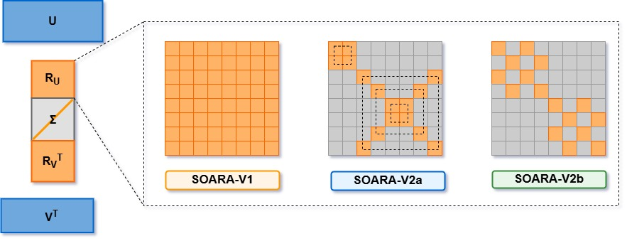
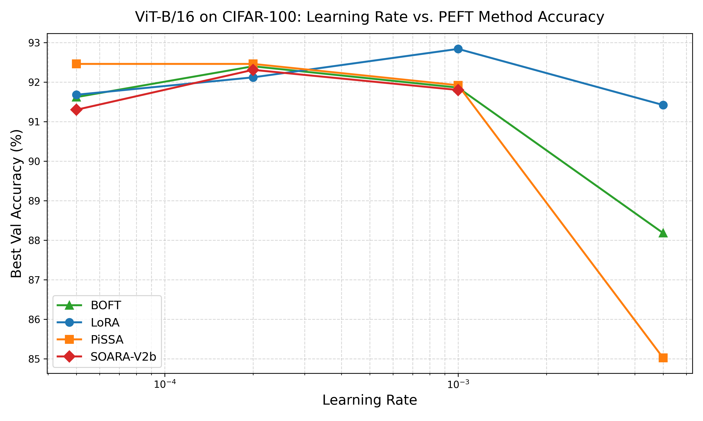
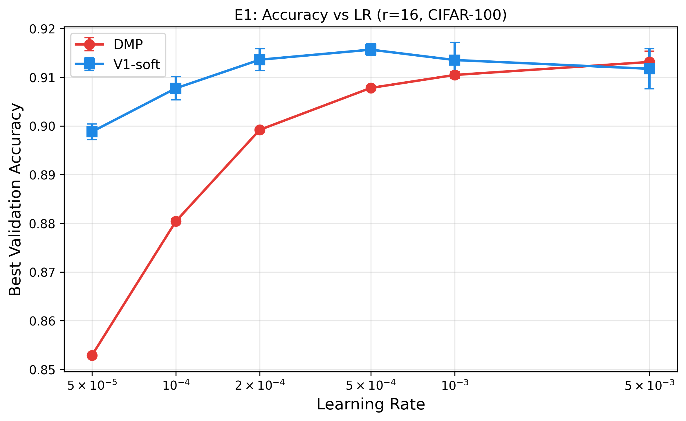
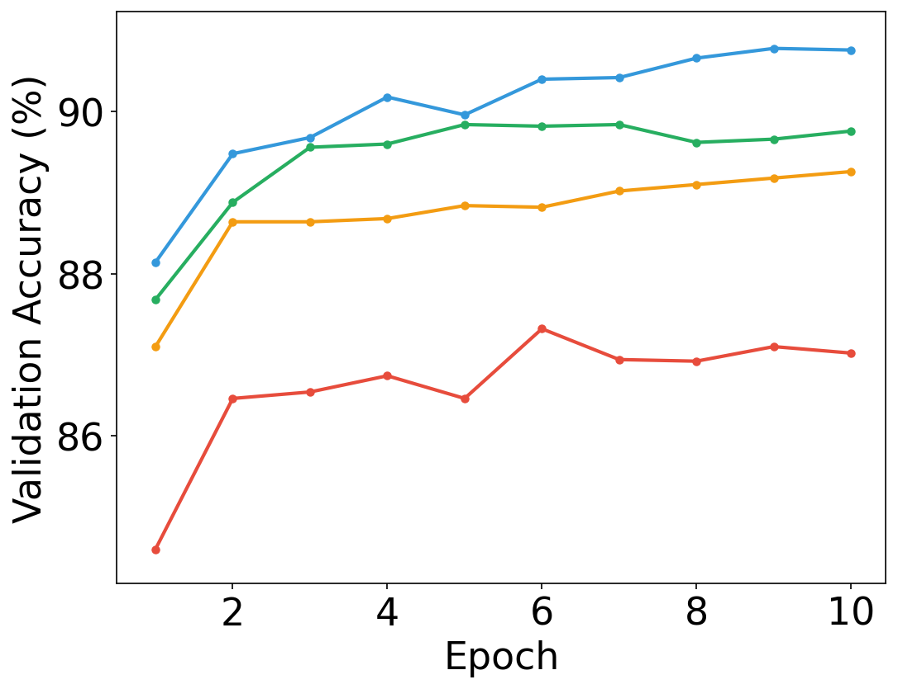
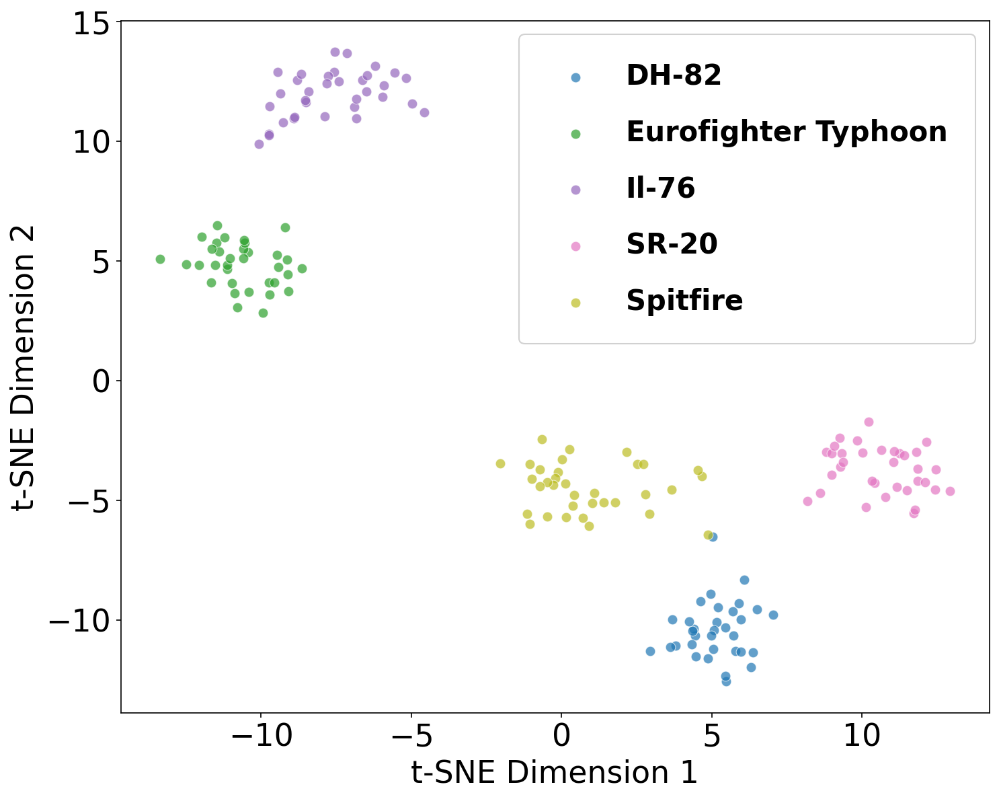

<p align="center">
  
</p>

<h1 align="center">SOARA: Subspace Orthogonal Adaptation via Rotational Alignment</h1>

<p align="center">
  <em>One Spin at a Time: Sequential Subspace Rotations for Parameter-Efficient Fine-Tuning</em>
</p>

<p align="center">
  <a href="https://jmlr.org/tmlr/"></a>
  <a href="https://arxiv.org/abs/XXXX.XXXXX"></a>
  <a href="https://www.python.org/downloads/"></a>
  <a href="https://pytorch.org/"></a>
  <a href="LICENSE"></a>
</p>

---

## Overview

**SOARA** (Subspace Orthogonal Adaptation via Rotational Alignment) is a family of parameter-efficient fine-tuning (PEFT) methods that adapt pretrained models by learning lightweight **rotational transformations** within SVD subspaces — rather than additive low-rank updates (LoRA) or spectral scaling (SVFT).

Given a pretrained weight matrix $W^* = U \Sigma V^\top$, SOARA reparameterizes the adaptation as:

$$W' = U \cdot R_U \cdot \Sigma_{\text{train}} \cdot R_V^\top \cdot V^\top$$

where $R_U, R_V$ are learnable rotation matrices and $\Sigma_{\text{train}}$ is a trainable diagonal matrix initialized from the leading singular values. This preserves the orthogonality of the pretrained basis while aligning it with downstream task geometry.

### Key Results

| Benchmark | Model | SOARA Accuracy | vs. Full FT | Params |
|---|---|---|---|---|
| **CIFAR-100** | ViT-B/16 | **92.32%** | +0.0 pp (surpasses FFT) | 129K (670× fewer) |
| **GLUE (avg)** | DeBERTa-v3 | **89.70%** | −0.2 pp | 0.59M (50% fewer than SVFT) |
| **GSM8K** | Gemma-7B | **76.50%** | +1.8 pp (surpasses FFT) | 6.45M (25% of PiSSA) |
| **Commonsense (avg)** | Llama-3-8B | **86.79%** | — | 1.44M |

---

## Method Variants

SOARA provides three parameterizations for the rotation matrices, offering different trade-offs between parameter count and exact orthogonality:

| Variant | Parameterization | Orthogonality | Params per Layer | Best For |
|---|---|---|---|---|
| **SOARA-V1** | Dense $R_U, R_V$ with regularization | Soft (via $\lambda\|R^\top R - I\|_F^2$) | $2r^2 + r$ | Moderate-rank regimes |
| **SOARA-V2a** | Sequential Givens rotations | Exact | $r/2$ per phase | Ultra-low parameter budgets |
| **SOARA-V2b** | Butterfly factorizations | Exact | $O(r \log r)$ | Best accuracy-parameter trade-off |

---

## Quick Start

### Installation

```bash
git clone https://github.com/chandan22140/soara-peft.git
cd soara-peft
pip install -e .
```

### SOARA-ify Any Model

```python
from soara import SOARAConfig, replace_linear_with_soara
from transformers import AutoModelForCausalLM

# Load any pretrained model
model = AutoModelForCausalLM.from_pretrained("meta-llama/Llama-3-8B")

# Configure SOARA
config = SOARAConfig(
    r=16,                    # Rank of the principal subspace
    method="v1",             # "v1", "V2" (Givens/Butterfly)
    orthogonality_reg_weight=1e-4,
)

# Replace target linear layers with SOARA layers
replace_linear_with_soara(
    model, 
    config, 
    target_modules=["q_proj", "v_proj", "k_proj", "o_proj"],
    exclude_modules=["lm_head", "embed_tokens"],
)

# That's it! Train as usual with any HF Trainer / PyTorch loop
# Only R_U, R_V, and Σ_train are trainable — everything else is frozen
```

### SOARA-V2b (Butterfly Sequential)

```python
config = SOARAConfig(
    method="V2",
    use_butterfly=True,
    butterfly_sequential=True,
    butterfly_block_size=2,    # BOFT(m, b=2) gives O(r log r) params
)

replace_linear_with_soara(model, config, target_modules=["q_proj", "v_proj"])
```

### Configuration Reference

```python
@dataclass
class SOARAConfig:
    # Core
    r: int = 16                           # Rank of principal subspace
    method: str = "v1"                    # "v1" | "V2" | "v3" | "V4"
    
    # V1: Regularization strength
    orthogonality_reg_weight: float = 1e-4
    
    # V2: Sequential training
    use_butterfly: bool = False           # True → butterfly, False → Givens
    butterfly_sequential: bool = False    # Train components one at a time
    steps_per_phase: int = 100            # Steps per Givens layer
    total_cycles: int = 3                 # Cycles through all layers
    
    # General
    freeze_singular_values: bool = False  # Freeze Σ_train
    quantize_residual: bool = False       # NF4 quantize W_residual
    rotation_side: str = "both"           # "both" | "u_only" | "v_only"
```

---

## Experimental Results

### Vision Benchmark (ViT-B/16)

SOARA-V2b achieves **72.47% mean accuracy** across 5 datasets — surpassing full fine-tuning (72.12%) with **670× fewer parameters**.

| Method | # Params | CIFAR-100 | DTD | SUN397 | FER2013 | FGVC | Avg |
|---|---|---|---|---|---|---|---|
| Full Fine-tuning | 86.6M | 92.4 | 72.4 | 75.0 | 68.2 | 52.6 | 72.12 |
| LoRA | 220K | 90.6 | 70.4 | 73.6 | 62.7 | 54.9 | 70.44 |
| **SOARA-V2b** | **129K** | **92.32** | **74.10** | 73.65 | 62.90 | **59.38** | **72.47** |
| SOARA-V1 (r=16) | 38K | 90.68 | 72.30 | 73.90 | 64.78 | 52.63 | 70.86 |
| SOARA-V2a (r=16) | 2.3K | 89.11 | 71.49 | 67.69 | 60.11 | 49.96 | 67.67 |

### GLUE Benchmark (DeBERTa-v3-base)

| Method | # Params | MNLI | SST-2 | MRPC | CoLA | QNLI | QQP | RTE | STS-B |
|---|---|---|---|---|---|---|---|---|---|
| Full FT | 184M | 89.90 | 95.63 | 89.46 | 69.19 | 94.03 | 92.40 | 83.75 | 91.60 |
| LoRA (r=8) | 1.33M | 90.65 | 94.95 | 89.95 | 69.82 | 93.87 | 91.99 | 85.20 | 91.60 |
| PiSSA (r=8) | 1.33M | 90.37 | 96.22 | 91.50 | 73.12 | 94.43 | 92.33 | 88.69 | 92.00 |
| **SOARA-V1 (r=64)** | **0.59M** | 89.85 | 95.76 | **93.60** | 73.11 | 94.03 | 91.11 | **88.81** | 91.30 |
| **SOARA-V2b** | **0.129M** | 89.31 | 95.41 | 92.85 | 73.10 | 93.63 | 89.39 | 86.28 | **92.02** |

### GSM8K Mathematical Reasoning

| Method | # Params | Peak GPU (GB) | GSM8K (%) |
|---|---|---|---|
| Full-FT | 8.5B | — | 74.67 |
| LoRA (r=32) | 68.8M | — | 76.57 |
| PiSSA (r=8) | 25M | — | **77.78** |
| **SOARA-V1 (r=128)** | **6.45M** | — | 76.50 |
| **SOARA-V2b** | **1.40M** | **38.47** | 76.09 |

> SOARA-V2b achieves comparable accuracy to SVFT-R (76.81%) while using **only 7.1%** of its parameter footprint and **half the GPU memory** (38.5 GB vs 77 GB).

---

## Figures

### Learning Rate Sensitivity

SOARA-V2b demonstrates stable performance across learning rates, competitive with LoRA, PiSSA, and BOFT:

<p align="center">
  
</p>

### Rotational Alignment vs. Direct Parameterization

V1-soft consistently outperforms unstructured DMP across all learning rates, confirming the benefit of the orthogonal inductive bias:

<p align="center">
  
</p>

### Convergence Analysis

Rank ablation on CIFAR-100 — increasing rank from $r=2$ to $r=16$ accelerates convergence with diminishing returns beyond $r=8$:

<p align="center">
  
</p>

### t-SNE Cluster Visualization

SOARA-V2b produces clean, well-separated class clusters in intermediate ViT representations (FGVC Aircraft):

<p align="center">
  
</p>

---

## Repository Structure

```
soara-peft/
├── README.md                        # This file
├── LICENSE                          # Apache 2.0
├── setup.py                         # pip install -e .
├── requirements.txt
│
├── soara/                           # Core library
│   ├── __init__.py                  # Public API
│   ├── soara_layer.py               # SOARAConfig, SOARALinearLayer, replace_linear_with_soara
│   └── soara_layer_v2b.py           # Butterfly-specific backend
│
├── scripts/                         # Training & evaluation
│   ├── train_vit.py                 # Vision benchmark (ViT-B/16)
│   ├── train_glue.py                # GLUE benchmark (DeBERTa-v3-base)
│   ├── train_commonsense.py         # Commonsense reasoning (Llama-3-8B)
│   ├── train_lora_baseline.py       # LoRA baseline for comparison
│   ├── eval_gsm8k.py                # GSM8K evaluation
│   ├── merge.py                     # Merge SOARA weights back into base model
│   ├── vram_profiler.py             # GPU memory profiling
│   ├── vision_table1_stats.py       # Vision results aggregation
│   ├── data.py                      # Dataset loading utilities
│   ├── logTrainer.py                # Custom HF Trainer with SOARA support
│   └── utils.py                     # Training utilities
│
├── ablations/                       # Ablation experiment scripts
│   ├── experiment_e1_dmp.py         # E1: DMP vs SOARA-V1 comparison
│   ├── experiment_e2_ortho_sweep.py # E2: Orthogonality regularization sweep
│   ├── experiment_e3_oracle.py      # E3: Oracle rotation experiment
│   └── run_all_ablations.py         # Run all ablation experiments
│
├── configs/                         # Experiment configurations
│   ├── vision/                      # ViT-B/16 sweep configs
│   ├── glue/                        # DeBERTa GLUE sweep configs
│   └── llm/                         # LLM training shell scripts
│
└── images/                          # Figures for README
    ├── SOARA_main2.jpg
    ├── lr_sweep_curves.png
    ├── convergence_cifar100.png
    ├── e1_accuracy_vs_lr.png
    └── tsne_way1_ablation_way1_bf_seq.png
```

---

## Citation

If you find SOARA useful in your research, please cite our paper:

```bibtex
@article{soara2025,
  title={One Spin at a Time: Sequential Subspace Rotations for Parameter-Efficient Fine-Tuning},
  author={[Author Names]},
  journal={Transactions on Machine Learning Research (TMLR)},
  year={2025},
  url={https://openreview.net/forum?id=XXXX}
}
```

---

## Acknowledgments

This work builds upon ideas from [PiSSA](https://github.com/MuLabPKU/PiSSA), [BOFT](https://github.com/huggingface/peft), [LoRA](https://github.com/microsoft/LoRA), and the broader PEFT community. We thank the authors of these works for making their code available.

---

## License

This project is licensed under the Apache License 2.0 — see the [LICENSE](LICENSE) file for details.
